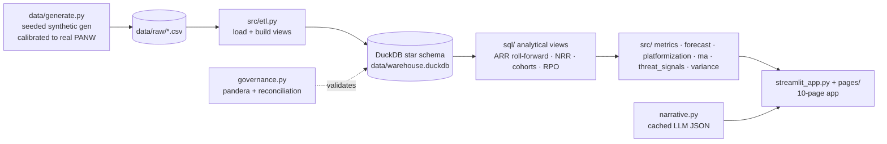

# 🧭 Pathfinder — A Predictive FP&A Engine for Palo Alto Networks

**Pathfinder is a portfolio-grade FP&A + data-science product** that models Palo Alto Networks'
(PANW) path to its **$20B Next-Gen Security (NGS) ARR target by FY2030** — combining driver-based
finance, classical & ML forecasting, M&A economics, and an external threat-signal demand layer in
one deployable Streamlit app.

> ⚠️ **All data is synthetic**, generated by a seeded simulator and *calibrated* to PANW's publicly
> disclosed figures (SEC EDGAR XBRL + earnings releases). No confidential data is used. See
> [`docs/assumptions.md`](docs/assumptions.md) for every real anchor and its source.

🔗 **Live demo:** _deploy to Streamlit Community Cloud (steps below) → `https://<app>.streamlit.app`_

---

## What it does (four integrated capabilities)

- **(A) NGS ARR forecast to $20B (FY2030)** — seasonal-naive baseline → SARIMA/ETS → gradient-boosted
  ML → bottoms-up driver model, all honestly **backtested** (rolling-origin CV), plus a scenario
  engine and a "required platformizations to hit $20B" solver.
- **(B) Platformization economics** — quantifies why a "platformized" customer is worth more
  (retention, expansion) and an interactive **NPV / IRR / payback** ROI model for incentive spend.
- **(C) M&A & organic-vs-inorganic** — decomposes organic vs acquired NGS ARR, models the
  **CyberArk (~$25B)** and **Chronosphere ($3.35B)** integration ramps & synergies, and an
  interactive **accretion/dilution + NPV** model for a hypothetical next tuck-in.
- **(D) Threat-signal demand layer** — tests whether external cyber-threat indicators (CVE volume,
  breach counts, an AI-threat index) are leading predictors of demand — reported **honestly**,
  including when they don't help.

## Architecture



**Stack:** Python 3.12 · DuckDB (SQL star schema) · pandas/numpy · scikit-learn · statsmodels ·
xgboost · pandera · Streamlit + Plotly.

## Run locally

```bash
git clone <this-repo> && cd pathfinder-panw-fpa
python3.12 -m venv .venv && source .venv/bin/activate
pip install -r requirements.txt
python data/generate.py        # writes data/raw/*.csv   (committed; optional to regenerate)
python src/etl.py              # builds data/warehouse.duckdb (committed; optional to rebuild)
streamlit run streamlit_app.py # → http://localhost:8501  (no secrets required)
pytest                         # data integrity, metric correctness, reconciliation
```

The committed CSVs + `data/warehouse.duckdb` mean the app runs immediately — the `generate`/`etl`
steps are only needed to rebuild from scratch.

## Deploy free to Streamlit Community Cloud

1. Push this repo to a **public** GitHub repo.
2. Go to <https://share.streamlit.io> → **New app** → pick the repo/branch, main file
   `streamlit_app.py`.
3. Under **Advanced settings**, select **Python 3.12**. No secrets needed (narratives are
   pre-cached). Click **Deploy** → you get a public `*.streamlit.app` URL.
4. *(Optional)* To enable live LLM narrative regeneration, add an `ANTHROPIC_API_KEY` in the app's
   **Secrets** and `pip install -r requirements-llm.txt` locally. The deployed demo never needs it.

## Repo layout

See [`docs/`](docs/) for the data dictionary, methodology, model card, finance concepts, the CFO
memo, and the engineer schema doc. New to SaaS FP&A? Start with **[`LEARN.md`](LEARN.md)** — a
plain-English tour of every metric and model.

## License / disclaimer

Educational portfolio project. Not affiliated with or endorsed by Palo Alto Networks. All figures
synthetic; real anchors are public and cited.
